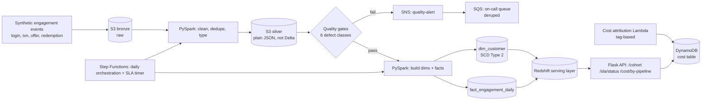

# Architecture

## ASCII — execution flow

```
  synthetic engagement events (login, card txn, offer, redemption)
             |
             v
  src/ingestion/data_gen.py --> src/ingestion/upload_bronze.py
             |
             v
        S3 bronze (raw)
             |
             v
  src/transformation/silver.py (PySpark)
    clean, dedupe, type -- plain Parquet/JSON, not Delta Lake
             |
             v
        S3 silver
             |
             v
  src/models/gates.py -- 6 data-quality gates, driven by
  src/transformation/pipeline.py
             |
      +------+------+
      |             |
    fail           pass
      |             |
      v             v
   SNS quality-alert   src/transformation/gold.py --> dim_customer (SCD Type 2)
      |                src/transformation/facts.py --> fact_engagement_daily, dim_offer
      v                     |
   SQS on-call queue        v
   (deduped alerts)   src/utils/warehouse.py :: DuckDB (Redshift stand-in)
                             |
                             v
                       src/serving/api.py :: Flask
                         /cohort  /sla/status  /cost/by-pipeline

  src/orchestration/statemachine.py
    orchestrates the daily run + an SLA timer via Lambdas:
    src/orchestration/lambdas/mark_started.py
    src/orchestration/lambdas/check_sla_lambda.py
             |
             v
  src/orchestration/cost_sla.py
    tag-based per-pipeline $/day --> DynamoDB cost table
```

## Mermaid (same flow)



## Data flow notes

- Quality gates sit **between** silver and gold — nothing reaches the dimensional model without passing all 6 checks.
- `dim_customer` is the only SCD Type 2 table; `fact_engagement_daily` is append-only and joins to whichever dimension version was valid at event time.
- The cost attribution Lambda runs independently of the daily pipeline, tagging S3/Redshift usage by pipeline label and writing daily deltas to DynamoDB.
