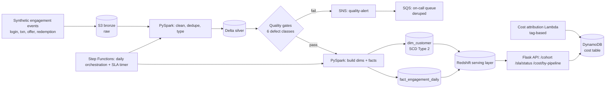

# Architecture

## Data flow notes

- Quality gates sit **between** silver and gold — nothing reaches the dimensional model without passing all 6 checks.
- `dim_customer` is the only SCD Type 2 table; `fact_engagement_daily` is append-only and joins to whichever dimension version was valid at event time.
- The cost attribution Lambda runs independently of the daily pipeline, tagging S3/Redshift usage by pipeline label and writing daily deltas to DynamoDB.
